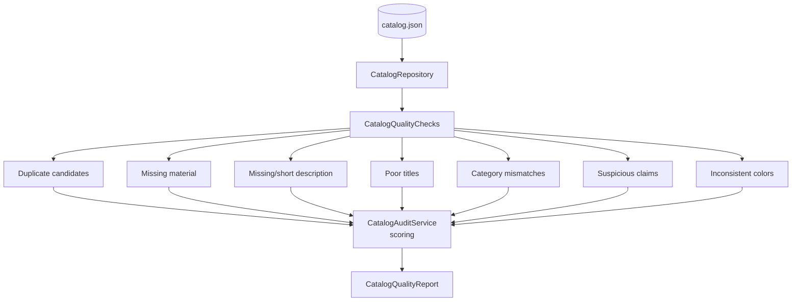

# Architecture

## Components



### ASCII fallback

```
catalog.json
     |
     v
CatalogRepository (in-memory, loaded once)
     |
     v
CatalogQualityChecks
  |-- duplicateCandidates          (same name+brand, different id)
  |-- missingMaterial              (blank material attribute)
  |-- missingOrShortDescription    (< 15 characters)
  |-- poorTitles                   (too short / ALL CAPS / generic word)
  |-- categoryMismatches           (name implies a different category)
  |-- suspiciousClaims             (unsupported superlative language)
  '-- inconsistentColors           (not clean Title Case)
     |
     v
CatalogAuditService  (per-occurrence penalty, ERROR > WARNING)
     |
     v
CatalogQualityReport (overallScore + findings + scoreBreakdown)
```

## Components

| Component | Responsibility |
|---|---|
| `CatalogRepository` | Loads the bundled catalog once, serves from memory |
| `CatalogQualityChecks` | Seven independent, named, deterministic checks |
| `CatalogAuditService` | Runs all seven, computes the per-occurrence-penalty score |
| `CatalogAuditController` | `GET /api/catalog/audit` |

## Important Interfaces

- Every check method takes the full product list and returns one
  `FindingSummary` — they share no state and can be tested (and read)
  independently. Adding an eighth check means adding one more method and
  one more line in `CatalogAuditService.audit()`.
- `FindingSummary.sampleProductIds` caps at 5 regardless of how many
  products a check flags — the point is a report a human can actually
  read, not a full dump.

## External Dependencies

- Spring Web (runtime)
- Spring Boot Test (JUnit 5, AssertJ — test scope only)
- No LLM dependency — every check here is a deterministic rule; see
  docs/design-decisions.md for where semantic/LLM-assisted checks
  (the master brief explicitly allows this) would plug in.

## Decision Points

- **Per-occurrence penalty, not per-unique-product.** A product flagged by
  two different checks (say, a poor title that also implies the wrong
  category) genuinely has two separate, independently real problems — the
  score should reflect both, not silently collapse them into one.
- **ERROR checks (missing description, category mismatch, suspicious
  claims) cost more per occurrence than WARNING checks** (duplicates,
  missing material, poor titles, inconsistent colors) — reflecting that a
  wrong category or a false marketing claim is a more serious problem than
  a stylistic inconsistency.
